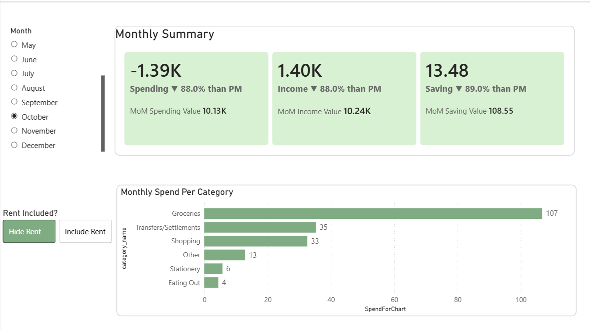
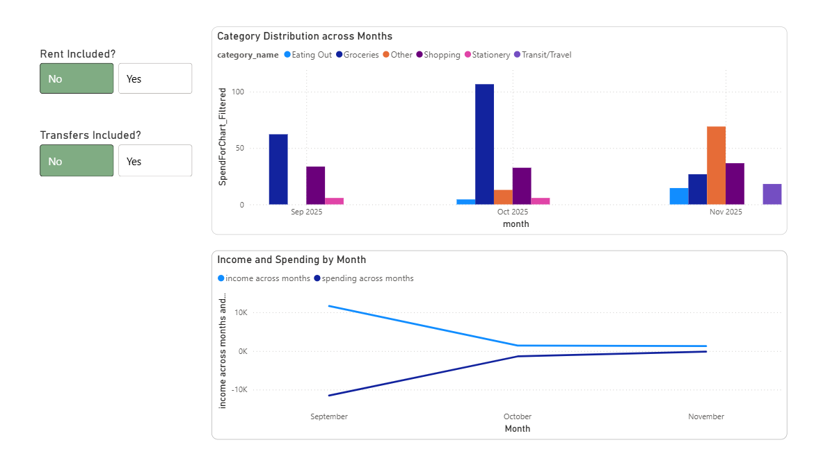

# SpendSense: Financial ETL and MoM Analytics Pipeline

**🚀 Reduced statement processing time from 1 hour → <10 seconds**  
**📈 Improved data quality from 84% → 100% validated, clean records**  
**📊 Built automated MoM dashboards to analyze spending and savings trends**


## Goal
To build a robust, production-ready pipeline for extracting unstructured financial data from PDFs, transforming it into analytics-ready records, and visualizing key financial metrics.

## Key Achievements
* **Performance:** Implemented a semi-automated ETL pipeline (Camelot, Pandas, PostgreSQL) that **cut monthly statement processing time** from ~1 hour to **< 10 seconds** (a ~90% reduction).
* **Data Quality:** Improved data extraction accuracy from ~84% raw to **100%** clean records; implemented robust **data-quality checks** (validation, handling, duplicate detection, category mapping).
* **Advanced Analytics:** Designed $\mathbf{SQL\ queries}$ to track spending $\mathbf{KPIs}$ and developed $\mathbf{Power\ BI}$ dashboards featuring dynamic controls to **filter non-core spending** (Rent, Transfers) and visualize **Month-over-Month (MoM) trends**.

## Technical Stack
* **Extraction & Transformation:** Python (Pandas, Camelot-Py)
* **Storage & Logic:** PostgreSQL, Advanced SQL (Window Functions, CTEs)
* **Visualization:** Power BI

## Dashboard Visualizations

### Monthly Summary KPIs
This view tracks MoM change for Spending, Income, and Net Savings, providing quick performance checks.


### Spending Trends and Category Distribution
This view allows dynamic filtering to analyze core spending (excluding transfers/rent) and tracks category distribution over time.


## Setup and Installation

1.  **Clone the repository:**
    ```bash
    git clone https://github.com/vidi-deshp12/SpendSense-ETL.git
    cd SpendSense-ETL

    ```
2.  **Setup Python Environment:**
    ```bash
    pip install -r requirements.txt
    ```
3.  **Database Setup:**
    * Create a PostgreSQL database named `spendsense`.
    * Run the schema setup script: `\i schema_setup.sql`
4.  **Run ETL:**
    * Open and execute the Jupyter notebook: `extract_v2.ipynb`
    * This extracts data from PDFs, cleans it, and loads it into PostgreSQL.   
6.  **Run Analytics:**
    * Run the KPI view script: `\i monthly_spending.sql`
    * This contains the MoM + category-level SQL logic.
8.  **View Dashboard:**
    * Open etl.pbix in Power BI Desktop.

## Roadmap (Future Development)
* Integrate Scikit-learn to build a classification model for automatic transaction category prediction.

* Containerize the ETL using Docker for easy deployment.


